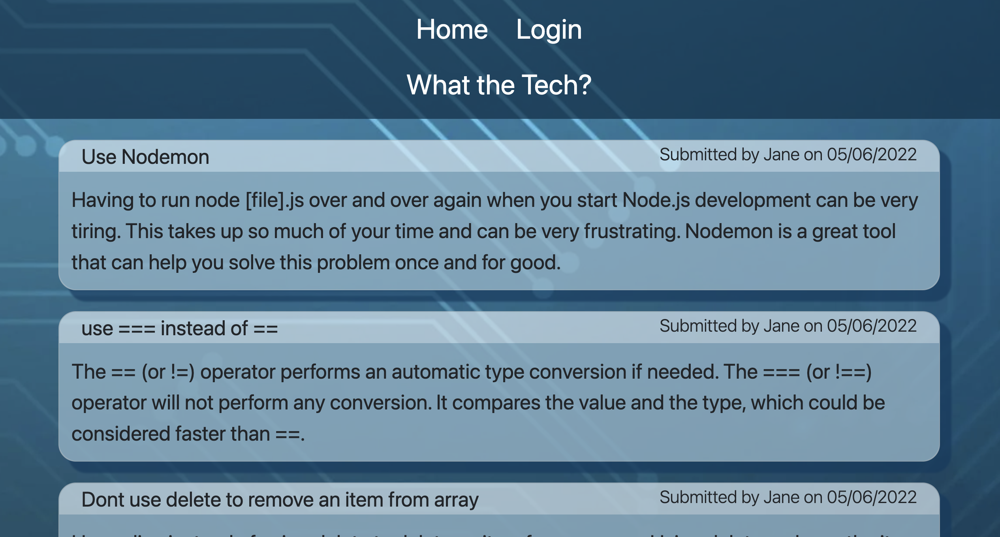
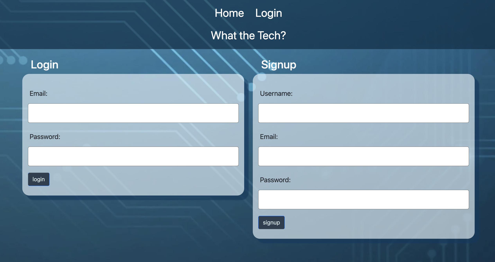
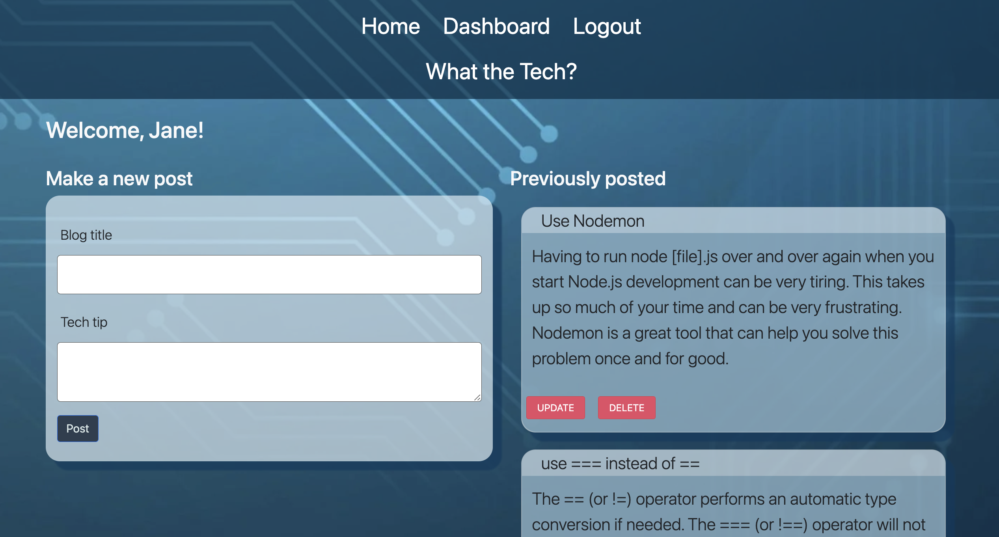

# Tech blog


## Description
A place to upload tech tips in a blog like forum. This includes signing up to the platform to make posts, and a way to edit your previous posts from your profile page.

Video Walkthrough is [here](https://www.loom.com/share/923c8f1337fd4fc5bb20341150c84f0c)

Hosted live on Heroku [here](https://polar-woodland-55276.herokuapp.com) 






## Table of Contents

* [Installation](#installation)
* [Usage](#usage)
* [Licenses](#licenses)
* [Contributing](#contributing)
* [Questions](#questions)

## Installation 
Please run the following command line to install the neccesary packages
```
npm i
```


## Usage
How to use this code

To view the blog head straight to https://polar-woodland-55276.herokuapp.com/, create an account and start posting from your profile!

Posts can only be made if you are logged in, as well as editing access.

## Licenses
This project is under the MIT License.

## Contributing
Contributions are what make the open source community such an amazing place to learn, inspire, and create. 

Any contributions welcome and suggestions.

## Questions

If you have any questions regarding this repository, you can contact me directly at jh.yield@gmail.com or find more of my work at [Key16](https://github.com/Key16)